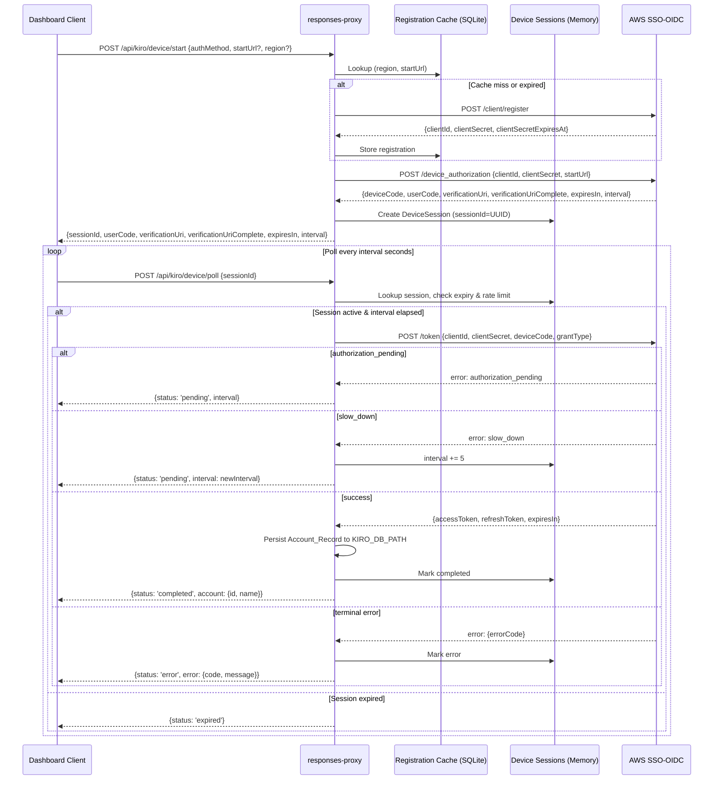

# Design Document: Kiro OAuth Device Login

## Overview

This feature implements the AWS SSO-OIDC Device Authorization Grant (RFC 8628) for connecting Kiro accounts directly from the responses-proxy dashboard. It introduces a new backend module (`src/kiro-device-login.ts`) that orchestrates the three-step OIDC flow — RegisterClient, StartDeviceAuthorization, CreateToken polling — and persists resulting accounts into the same `providerConnections` table used by `kiro-token-store.ts`.

The design splits cleanly into:
- **Backend service** — stateless OIDC orchestration with in-memory session tracking
- **Registration cache** — SQLite-backed client credential cache to avoid redundant registrations
- **API layer** — two Fastify routes (`/api/kiro/device/start`, `/api/kiro/device/poll`)
- **Client layer** — typed API client functions and a new `device_login` step in `AccountConnectionFlow.tsx`

The polling model is server-driven: the browser polls the proxy, and the proxy polls the OIDC endpoint. This avoids exposing `deviceCode` or `clientSecret` to the client.

## Architecture



## Components and Interfaces

### Backend Module: `src/kiro-device-login.ts`

```typescript
import type { AppConfig } from "./config.js";

// ─── Input/Output Types ───

export type DeviceLoginAuthMethod = "builder_id" | "idc";

export interface StartDeviceLoginInput {
  authMethod: DeviceLoginAuthMethod;
  startUrl?: string;
  region?: string;
}

export interface StartDeviceLoginResult {
  sessionId: string;
  userCode: string;
  verificationUri: string;
  verificationUriComplete: string;
  expiresIn: number;
  interval: number;
}

export type PollStatus = "pending" | "completed" | "expired" | "error";

export interface PollDeviceLoginResult {
  status: PollStatus;
  interval?: number;
  account?: { id: string; name: string };
  error?: { code: string; message: string };
}

// ─── Device Session (in-memory) ───

export interface DeviceSession {
  sessionId: string;
  deviceCode: string;
  clientId: string;
  clientSecret: string;
  interval: number;
  expiresAt: number; // Unix ms
  region: string;
  startUrl: string;
  authMethod: DeviceLoginAuthMethod;
  status: PollStatus;
  lastPollAt: number; // Unix ms, for rate limiting
  completedAccount?: { id: string; name: string };
  error?: { code: string; message: string };
}

// ─── Registration Cache Row ───

export interface RegistrationCacheEntry {
  region: string;
  startUrl: string;
  clientId: string;
  clientSecret: string;
  clientSecretExpiresAt: number; // Unix seconds (from AWS response)
}

// ─── Service Class ───

export interface DeviceLoginServiceDeps {
  config: AppConfig;
  dbPath: string; // KIRO_DB_PATH for persistence
  fetchImpl?: typeof fetch;
}

export class DeviceLoginService {
  private sessions: Map<string, DeviceSession>;

  constructor(deps: DeviceLoginServiceDeps);

  /** Starts a device login: registers client (if needed), starts device auth, creates session. */
  startDeviceLogin(input: StartDeviceLoginInput): Promise<StartDeviceLoginResult>;

  /** Polls an existing device session. Contacts OIDC /token if interval has elapsed. */
  pollDeviceLogin(sessionId: string): Promise<PollDeviceLoginResult>;

  /** Cleanup expired sessions (called periodically or on access). */
  pruneExpiredSessions(): void;
}
```

### Registration Cache Operations (internal to DeviceLoginService)

```typescript
// Internal functions — not exported, operate on the APP_DB_PATH SQLite database

function getRegistrationCache(db: Database, region: string, startUrl: string): RegistrationCacheEntry | undefined;
function setRegistrationCache(db: Database, entry: RegistrationCacheEntry): void;
```

### API Routes (in `src/server.ts`)

```typescript
// POST /api/kiro/device/start
// Request body:
interface DeviceStartRequestBody {
  authMethod: "builder_id" | "idc";
  startUrl?: string;
  region?: string;
}
// Response (200):
interface DeviceStartResponse {
  ok: true;
  sessionId: string;
  userCode: string;
  verificationUri: string;
  verificationUriComplete: string;
  expiresIn: number;
  interval: number;
}
// Error response (4xx/5xx):
interface DeviceErrorResponse {
  error: {
    type: string;
    code: string;
    message: string;
  };
}

// POST /api/kiro/device/poll
// Request body:
interface DevicePollRequestBody {
  sessionId: string;
}
// Response (200):
interface DevicePollResponse {
  ok: true;
  status: "pending" | "completed" | "expired" | "error";
  interval?: number;
  account?: { id: string; name: string };
  error?: { code: string; message: string };
}
```

### Client API Additions (`client/src/api/client.ts`)

```typescript
export type KiroDeviceStartInput = {
  authMethod: "builder_id" | "idc";
  startUrl?: string;
  region?: string;
};

export type KiroDeviceStartResponse = {
  ok: true;
  sessionId: string;
  userCode: string;
  verificationUri: string;
  verificationUriComplete: string;
  expiresIn: number;
  interval: number;
};

export type KiroDevicePollResponse = {
  ok: true;
  status: "pending" | "completed" | "expired" | "error";
  interval?: number;
  account?: { id: string; name: string };
  error?: { code: string; message: string };
};

export function startKiroDeviceLogin(input: KiroDeviceStartInput) {
  return apiSend<KiroDeviceStartResponse>("/api/kiro/device/start", "POST", input);
}

export function pollKiroDeviceLogin(sessionId: string) {
  return apiSend<KiroDevicePollResponse>("/api/kiro/device/poll", "POST", { sessionId });
}
```

### UI Changes (`client/src/components/accounts/AccountConnectionFlow.tsx`)

A new step `'device_login'` is added to the existing step union:

```typescript
type FlowStep = 'start' | 'authorize' | 'callback' | 'kiro_import' | 'device_login' | 'complete';
```

The `device_login` step renders:
1. Auth method picker (Builder ID vs IDC) with optional startUrl/region inputs for IDC
2. After start: displays `userCode` prominently, `verificationUriComplete` as a clickable link
3. Polling spinner with "Waiting for browser approval..." text
4. Auto-transitions to `'complete'` on success, or shows error inline on failure/expiry

### Configuration Additions (`src/config.ts`)

```typescript
// Added to envSchema:
KIRO_DEVICE_CLIENT_NAME: z.string().min(1).default("responses-proxy"),
KIRO_BUILDER_ID_START_URL: z.string().min(1).default("https://view.awsapps.com/start"),
KIRO_DEVICE_SCOPES: z.string().min(1).default("codewhisperer:completions,codewhisperer:analysis")
  .transform((v) => v.split(",").map((s) => s.trim()).filter(Boolean)),
```

## Data Models

### Registration Cache Table (in `APP_DB_PATH` SQLite database)

```sql
CREATE TABLE IF NOT EXISTS kiro_registration_cache (
  region TEXT NOT NULL,
  startUrl TEXT NOT NULL,
  clientId TEXT NOT NULL,
  clientSecret TEXT NOT NULL,
  clientSecretExpiresAt INTEGER NOT NULL,
  createdAt TEXT NOT NULL DEFAULT (datetime('now')),
  PRIMARY KEY (region, startUrl)
);
```

The cache is keyed by `(region, startUrl)` because registration parameters differ between Builder ID (fixed startUrl, default region) and IDC (user-supplied both). `clientSecretExpiresAt` is stored as Unix seconds (matches AWS OIDC response format). The cache is colocated with `APP_DB_PATH` (not `KIRO_DB_PATH`) because it's operational state for the proxy, not account data.

### Device Session (in-memory Map)

```typescript
// Map<sessionId, DeviceSession> — lives in DeviceLoginService instance
// Sessions are short-lived (~10 min max based on AWS expiresIn, typically 600s)
// No persistence needed — if the proxy restarts, users simply re-initiate the flow

interface DeviceSession {
  sessionId: string;         // crypto.randomUUID()
  deviceCode: string;        // from AWS StartDeviceAuthorization
  clientId: string;          // from RegisterClient or cache
  clientSecret: string;      // from RegisterClient or cache
  interval: number;          // polling interval in seconds (starts ~5, may increase on slow_down)
  expiresAt: number;         // Date.now() + expiresIn * 1000
  region: string;            // resolved region
  startUrl: string;          // resolved startUrl
  authMethod: DeviceLoginAuthMethod;
  status: PollStatus;        // 'pending' | 'completed' | 'expired' | 'error'
  lastPollAt: number;        // last time CreateToken was called (rate limit enforcement)
  completedAccount?: { id: string; name: string };
  error?: { code: string; message: string };
}
```

### Account Record (written to `KIRO_DB_PATH` providerConnections table)

Uses the existing `PROVIDER_CONNECTIONS_DDL` from `kiro-import.ts`. The `data` column JSON structure:

```typescript
interface PersistedDataJson {
  accessToken: string;
  refreshToken: string;
  expiresAt: string;       // ISO 8601, completionTime + expiresIn seconds
  expiresIn: number;       // seconds
  providerSpecificData: {
    clientId: string;
    clientSecret: string;
    region: string;
    authMethod: "builder_id" | "idc";
    startUrl: string;
    profileArn: string | null;  // null initially, populated after first use
  };
}
```

## Correctness Properties

*A property is a characteristic or behavior that should hold true across all valid executions of a system — essentially, a formal statement about what the system should do. Properties serve as the bridge between human-readable specifications and machine-verifiable correctness guarantees.*

### Property 1: Registration cache round-trip

*For any* valid (region, startUrl) pair and registration response containing a clientId, clientSecret, and future clientSecretExpiresAt, storing the registration in the cache and then looking it up with the same (region, startUrl) key should return the identical clientId and clientSecret.

**Validates: Requirements 1.3, 1.4**

### Property 2: Cache miss triggers registration

*For any* (region, startUrl) pair where the registration cache is empty or the cached entry's clientSecretExpiresAt is in the past, starting a device login should invoke RegisterClient against the OIDC endpoint exactly once.

**Validates: Requirements 1.1**

### Property 3: IDC registration includes issuerUrl and grantTypes

*For any* IDC login request (authMethod = "idc") with a valid startUrl, the RegisterClient request body sent to the OIDC endpoint should include `issuerUrl` equal to the startUrl and `grantTypes` containing `"urn:ietf:params:oauth:grant-type:device_code"`.

**Validates: Requirements 1.2**

### Property 4: Session creation preserves authorization response fields

*For any* valid StartDeviceAuthorization response containing deviceCode, userCode, verificationUri, verificationUriComplete, expiresIn, and interval, the created DeviceSession should contain the deviceCode and computed expiresAt, and the returned result should contain all of userCode, verificationUri, verificationUriComplete, expiresIn, and interval.

**Validates: Requirements 2.2, 2.3**

### Property 5: authorization_pending keeps session pending

*For any* active DeviceSession (status = "pending", not expired), when CreateToken returns error `authorization_pending`, the session status should remain "pending" and the returned interval should equal the session's current interval.

**Validates: Requirements 3.3**

### Property 6: slow_down increases interval by exactly 5 seconds

*For any* active DeviceSession with current interval N, when CreateToken returns error `slow_down`, the session interval should become N + 5 and the returned interval should equal N + 5.

**Validates: Requirements 3.4**

### Property 7: Expired session rejects polling

*For any* DeviceSession whose expiresAt is earlier than the current time, polling should return status "expired" without sending a CreateToken request to the OIDC endpoint.

**Validates: Requirements 3.5**

### Property 8: Terminal OIDC error transitions session to error state

*For any* CreateToken error code that is not "authorization_pending" and not "slow_down", the DeviceSession should transition to status "error" and the returned error object should contain the error code.

**Validates: Requirements 3.7**

### Property 9: Polling rate limit enforcement

*For any* active DeviceSession with interval N seconds, if two poll requests arrive within N seconds of each other, at most one CreateToken request should be sent to the OIDC endpoint. The second poll should return the current status without contacting OIDC.

**Validates: Requirements 3.6**

### Property 10: IDC validation rejects empty startUrl or region

*For any* string composed entirely of whitespace (or empty string) supplied as startUrl or region for an IDC login request, the service should return a validation error and should not contact the OIDC endpoint.

**Validates: Requirements 4.3, 4.4**

### Property 11: Account persistence on successful completion

*For any* successful CreateToken response containing accessToken, refreshToken, and expiresIn, the written Account_Record should have: provider = "kiro", Data_JSON containing all token fields, providerSpecificData containing clientId/clientSecret/region/authMethod/startUrl, expiresAt computed as completionTime + expiresIn seconds, isActive = 1, priority > 0, and a valid UUID id.

**Validates: Requirements 5.1, 5.2, 5.3, 5.4, 5.5**

### Property 12: Error responses have consistent structure

*For any* error condition in the Device_Login_Service (registration failure, authorization failure, token error, validation error, network error), the API response should contain an `error` object with non-empty `type`, `code`, and `message` string fields.

**Validates: Requirements 8.3**

### Property 13: No secrets in API responses

*For any* response returned by `/api/kiro/device/start` or `/api/kiro/device/poll`, the JSON response body should never contain a full `accessToken`, `refreshToken`, or `clientSecret` value.

**Validates: Requirements 9.2**

## Error Handling

| Error Condition | HTTP Status | Error Code | User Message |
|---|---|---|---|
| `KIRO_ENABLED` is false | 409 | `KIRO_DISABLED` | "Kiro is disabled. Set KIRO_ENABLED=true." |
| `KIRO_WRITE_BACK_ENABLED` is false | 409 | `KIRO_WRITE_BACK_DISABLED` | "Device login cannot persist accounts when write-back is disabled." |
| IDC missing startUrl | 422 | `VALIDATION_MISSING_START_URL` | "IDC login requires a non-empty startUrl." |
| IDC missing region | 422 | `VALIDATION_MISSING_REGION` | "IDC login requires a non-empty region." |
| RegisterClient HTTP error | 502 | `OIDC_REGISTER_FAILED` | "Client registration failed: {status} {body excerpt}." |
| StartDeviceAuthorization HTTP error | 502 | `OIDC_DEVICE_AUTH_FAILED` | "Device authorization failed: {status}." |
| CreateToken terminal error | 200 (in poll response) | `OIDC_TOKEN_ERROR_{code}` | "Authorization failed: {error description}." |
| Network failure to OIDC | 502 | `OIDC_NETWORK_ERROR` | "Cannot reach AWS SSO-OIDC endpoint." |
| Unknown sessionId in poll | 404 | `SESSION_NOT_FOUND` | "Device login session not found or already completed." |
| Session expired | 200 (in poll response) | — | Status "expired" (no error object, client shows timeout message) |
| DB write failure on persist | 500 | `ACCOUNT_PERSIST_FAILED` | "Failed to save account after successful login." |

All error responses follow the existing proxy pattern:
```json
{
  "error": {
    "type": "configuration_error | validation_error | upstream_error | internal_error",
    "code": "KIRO_DISABLED",
    "message": "Human-readable description"
  }
}
```

Secret fields (`clientSecret`, `accessToken`, `refreshToken`) are never included in error messages or log output. The service uses structured logging with explicit field allowlists.

## Testing Strategy

### Property-Based Tests (Vitest + fast-check)

The polling state machine and registration cache are pure-logic components well suited to property-based testing. Each property test runs a minimum of 100 iterations.

**Library**: `fast-check` (already available in the npm ecosystem, pairs with Vitest)

**Test file**: `src/__tests__/kiro-device-login.prop.test.ts`

Properties to implement:
- **Feature: kiro-oauth-device-login, Property 1**: Registration cache round-trip
- **Feature: kiro-oauth-device-login, Property 5**: authorization_pending keeps session pending
- **Feature: kiro-oauth-device-login, Property 6**: slow_down increases interval by exactly 5
- **Feature: kiro-oauth-device-login, Property 7**: Expired session rejects polling
- **Feature: kiro-oauth-device-login, Property 8**: Terminal error transitions to error state
- **Feature: kiro-oauth-device-login, Property 9**: Polling rate limit enforcement
- **Feature: kiro-oauth-device-login, Property 10**: IDC validation rejects empty startUrl/region
- **Feature: kiro-oauth-device-login, Property 11**: Account persistence fields
- **Feature: kiro-oauth-device-login, Property 12**: Error response structure invariant
- **Feature: kiro-oauth-device-login, Property 13**: No secrets in API responses

**Generators needed**:
- `arbDeviceSession()` — random DeviceSession with configurable status, interval, expiresAt
- `arbRegistrationResponse()` — random clientId, clientSecret, clientSecretExpiresAt
- `arbTokenResponse()` — random accessToken, refreshToken, expiresIn
- `arbOidcErrorCode()` — random error codes (excluding known pending/slow_down)
- `arbRegionStartUrl()` — random (region, startUrl) pairs
- `arbWhitespaceString()` — strings of only whitespace characters

### Unit Tests (Vitest)

**Test file**: `src/__tests__/kiro-device-login.test.ts`

Example-based tests for:
- Builder ID parameter resolution (uses configured defaults)
- IDC parameter pass-through
- Full happy-path integration (mock OIDC, verify account persisted)
- KIRO_ENABLED / KIRO_WRITE_BACK_ENABLED gate checks
- Unknown/completed session poll returns 404
- RegisterClient error → structured error response
- Network timeout handling

### Integration Tests

- End-to-end flow with mocked OIDC endpoint (nock or msw)
- Registration cache SQLite read/write cycle
- Account persistence verifiable by `KiroTokenStore.getAccount()`

## Files Modified

| File | Change |
|---|---|
| `src/kiro-device-login.ts` | **New** — `DeviceLoginService` class, types, registration cache helpers |
| `src/config.ts` | Add `KIRO_DEVICE_CLIENT_NAME`, `KIRO_BUILDER_ID_START_URL`, `KIRO_DEVICE_SCOPES` to `envSchema` |
| `src/server.ts` | Add `POST /api/kiro/device/start` and `POST /api/kiro/device/poll` routes |
| `client/src/api/client.ts` | Add `startKiroDeviceLogin()`, `pollKiroDeviceLogin()` functions |
| `client/src/api/types.ts` | Add `KiroDeviceStartInput`, `KiroDeviceStartResponse`, `KiroDevicePollResponse` types |
| `client/src/components/accounts/AccountConnectionFlow.tsx` | Add `device_login` step with auth method picker, code display, polling UI |
| `.env.example` | Add new config keys with defaults |
| `src/__tests__/kiro-device-login.test.ts` | **New** — unit tests |
| `src/__tests__/kiro-device-login.prop.test.ts` | **New** — property-based tests |
